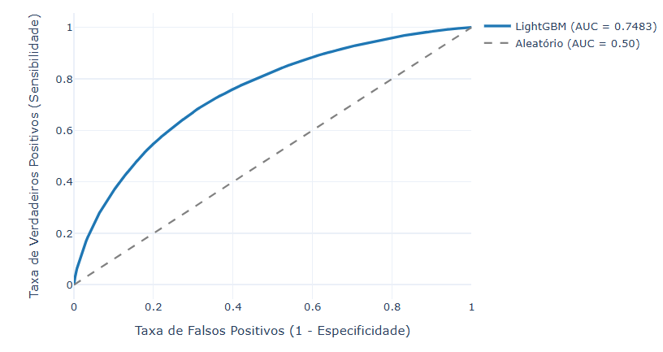
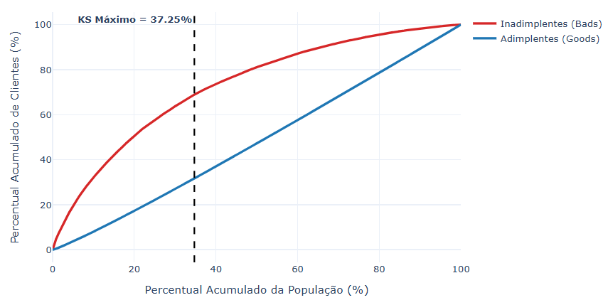

# 💳 Modelo de Machine Learning para Avaliação e Previsão de Risco de Crédito

Este repositório contém uma solução completa de Machine Learning voltada para o setor financeiro, focada em prever o risco de inadimplência de clientes (*Credit Scoring*) com base em dados históricos de birôs e pedidos anteriores.

---

## 🚀 Tecnologias e Ferramentas Utilizadas
* **Python** (Linguagem principal)
* **DuckDB & SQL** (Consultas OLAP de alta performance, agregações relacionais e tratamento de views diretamente em arquivos Parquet)
* **OptBinning** (Tratamento de variáveis, *Weight of Evidence - WoE* e cálculo de *Information Value - IV*)
* **LightGBM** (Modelo de *Gradient Boosting* de alta performance)
* **Scikit-Learn & Pandas** (Processamento de dados e validação cruzada)
* **Plotly** (Visualização interativa de métricas)

---

## 📊 Arquitetura e Fluxo do Projeto

1. **`notebooks/01_eda.ipynb`**: Análise exploratória inicial, agregação de dados relacionais via DuckDB e mapeamento de perfis de contratos.
2. **`notebooks/02_visao_cliente_pipeline.ipynb`**: Engenharia de atributos, tratamento de anomalias (ex: `DAYS_EMPLOYED`), binnagem otimizada e filtragem de variáveis preditivas por *Information Value* (IV) utilizando consultas SQL integradas.
3. **`notebooks/03_model_training.ipynb`**: Validação cruzada estratificada em 5 *folds*, treinamento do LightGBM, exportação do artefato do modelo e geração de gráficos de desempenho.
4. **`src/predict.py`**: Script modular de inferência automatizada para pontuar novos lotes de clientes.

---

## 📈 Desempenho do Modelo (Out-Of-Fold)

O modelo foi validado rigorosamente através de validação cruzada (*5-Fold Stratified Cross-Validation*), alcançando os seguintes resultados fora da amostra (OOF):

* **ROC-AUC:** 0.7483
* **Gini:** 0.4965
* **KS (Kolmogorov-Smirnov):** 37.25%

### Curva ROC (OOF)


### Curva KS (Kolmogorov-Smirnov)


---

## ⚙️ Como Executar o Projeto

1. **Clone o repositório:**
   ```bash
   git clone [https://github.com/camargodiego/risco-credito-ml.git](https://github.com/camargodiego/risco-credito-ml.git)
   cd risco-credito-ml